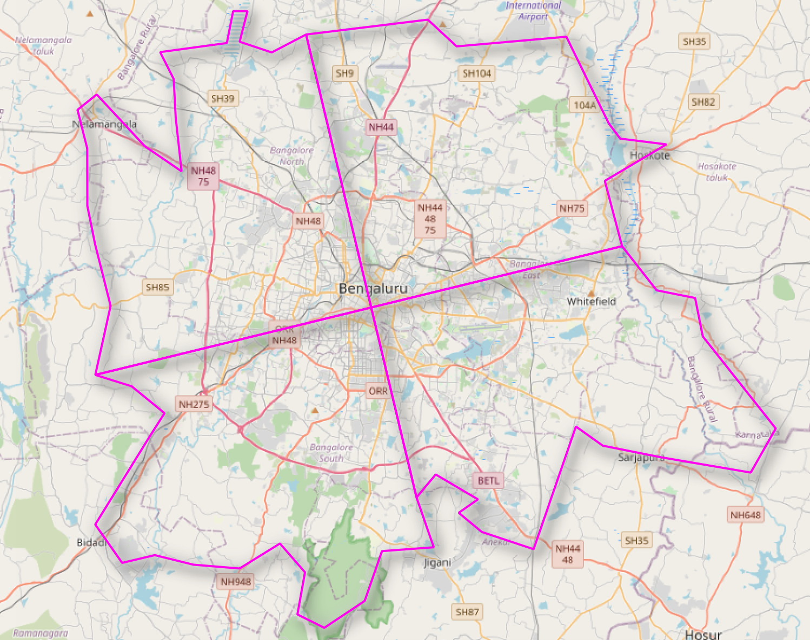
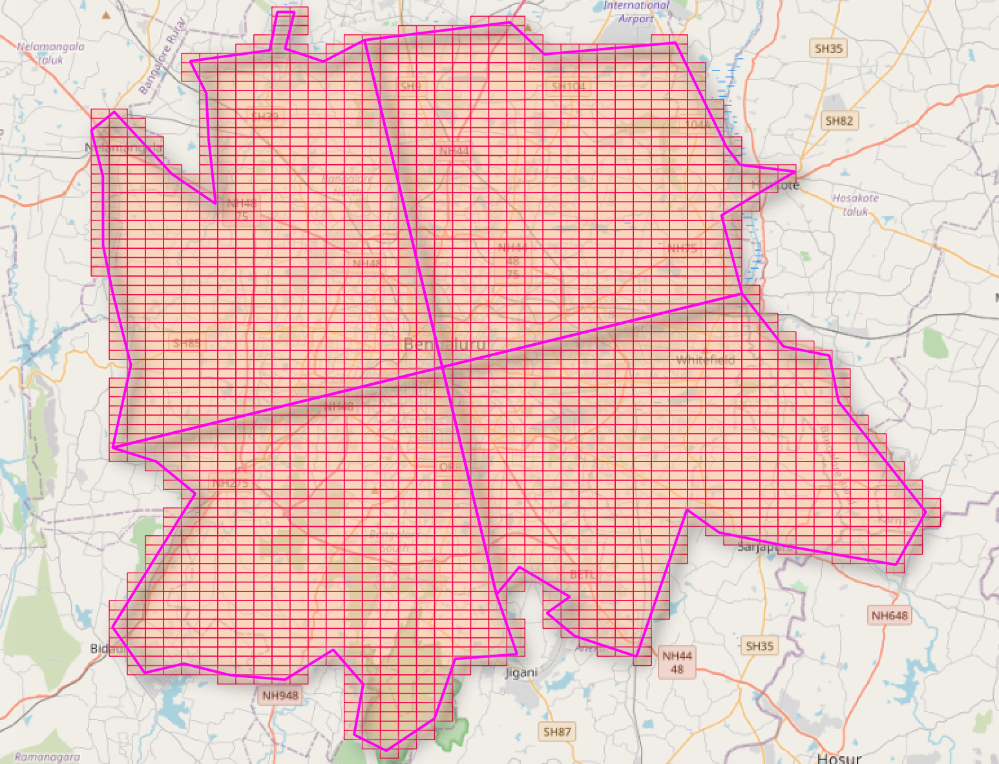
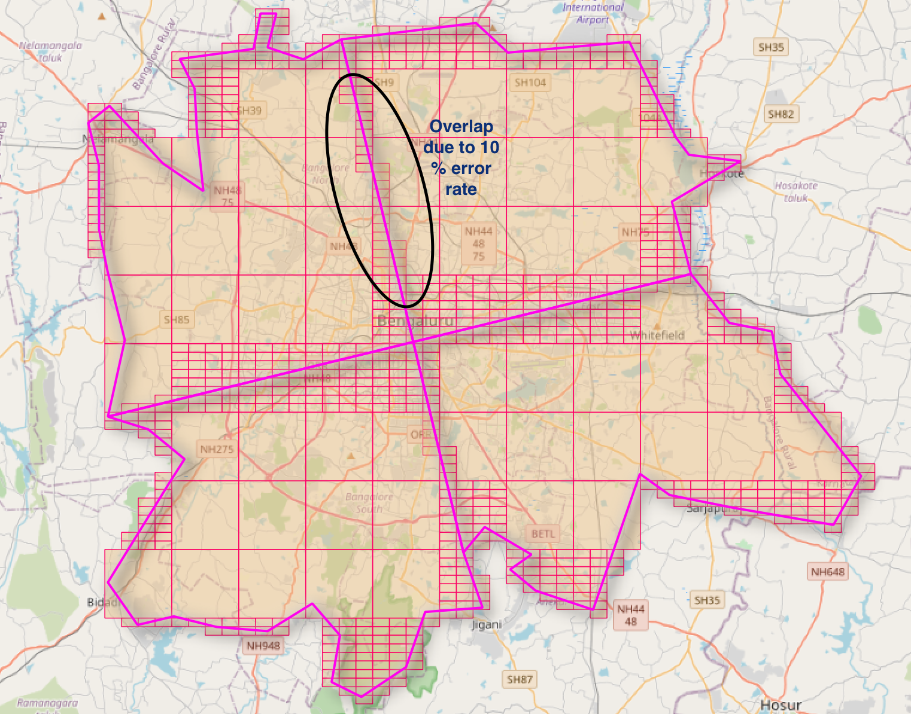

# polygeohasher

polygeohasher is a python package to implement polygon to geohash and vice versa with optimisation of geohash levels as per the user requirement, with error rate being controlled by the user.

## Installation

Use the package manager [pip](https://pip.pypa.io/en/stable/) to install polygeohasher.

```bash
pip install polygeohasher

#install all dependencies
pip3 install -r requirements.txt

```

## Usage

polygeohasher provides two API styles: **functional** and **class-based**. Both approaches provide identical functionality, so you can choose the style that best fits your coding preferences.

### Functional API (Recommended)

```python
import geopandas as gpd
from polygeohasher import create_geohash_list, geohash_optimizer, geohashes_to_geometry, optimization_summary

# Read your geometry file
gdf = gpd.read_file("your_geospatial_file.geojson")

# Step 1: Convert geometries to geohashes
geohash_level = 7  # Precision level (1-12)
primary_df = create_geohash_list(gdf, geohash_level, inner=False)

# Step 2: Optimize geohash levels to reduce count while maintaining coverage
largest_gh_size = 4    # Minimum precision (larger geohashes)
smallest_gh_size = 8   # Maximum precision (smaller geohashes)
secondary_df = geohash_optimizer(
    primary_df, 
    largest_gh_size, 
    smallest_gh_size, 
    geohash_level,
    percentage_error=10  # Allow 10% error in optimization
)

# Step 3: View optimization results
optimization_summary(primary_df, secondary_df)
# Output:
# --------------------------------------------------
#             OPTIMIZATION SUMMARY
# --------------------------------------------------
# Total Counts of Initial Geohashes :  2597
# Total Counts of Final Geohashes   :  837
# Percent of optimization           :  67.77 %
# --------------------------------------------------

# Step 4: Convert optimized geohashes back to geometries for visualization
geo_df = geohashes_to_geometry(secondary_df, "optimized_geohash_list")

# Step 5: Save the result
geo_df.to_file("optimized_geohashes.geojson", driver="GeoJSON")
```

### Class-based API

```python
import geopandas as gpd
from polygeohasher import Polygeohasher

# Read your geometry file
gdf = gpd.read_file("your_geospatial_file.geojson")

# Initialize the Polygeohasher with your GeoDataFrame
pgh = Polygeohasher(gdf)

# Step 1: Convert geometries to geohashes
geohash_level = 7
primary_df = pgh.create_geohash_list(geohash_level, inner=False)

# Step 2: Optimize geohash levels
largest_gh_size = 4
smallest_gh_size = 8
secondary_df = pgh.geohash_optimizer(
    primary_df, 
    largest_gh_size, 
    smallest_gh_size, 
    geohash_level,
    percentage_error=10
)

# Step 3: View optimization results
pgh.optimization_summary(primary_df, secondary_df)

# Step 4: Convert back to geometries
geo_df = pgh.geohashes_to_geometry(secondary_df, "optimized_geohash_list")

# Step 5: Save the result
geo_df.to_file("optimized_geohashes.geojson", driver="GeoJSON")
```

### API Reference

#### Core Functions

- **`create_geohash_list(gdf, geohash_level, inner=False)`**: Convert geometries to geohash lists
  - `gdf`: GeoDataFrame with geometry column
  - `geohash_level`: Precision level (1-12, higher = more precise)
  - `inner`: If True, only include geohashes completely inside polygons

- **`geohash_optimizer(gdf_with_geohashes, largest_gh_size, smallest_gh_size, gh_input_level, percentage_error=10, forced_gh_upscale=False)`**: Optimize geohash levels
  - `gdf_with_geohashes`: DataFrame with geohash_list column
  - `largest_gh_size`: Minimum precision level (larger geohashes)
  - `smallest_gh_size`: Maximum precision level (smaller geohashes)
  - `gh_input_level`: Input geohash precision level
  - `percentage_error`: Allowed optimization error percentage
  - `forced_gh_upscale`: Force upscaling to smallest_gh_size

- **`geohashes_to_geometry(df, geohash_column_name="optimized_geohash_list")`**: Convert geohashes to geometries
  - `df`: DataFrame with geohash column
  - `geohash_column_name`: Name of column containing geohashes

- **`optimization_summary(initial_gdf, final_gdf)`**: Print optimization statistics
  - `initial_gdf`: DataFrame with initial geohash_list
  - `final_gdf`: DataFrame with optimized geohashes

## Some visualisations



Study are consist of division of City of Bengaluru in India.



Primary Output of geohashes without any optimisation.



Final Output of geohashes with optimization of number of geohashes at different levels to cover an area.


## Contributing
Pull requests are welcome. For major changes, please open an issue first to discuss what you would like to change.

Please make sure to update tests as appropriate.

## License
[Apache License, Version 2.0](http://www.apache.org/licenses/LICENSE-2.0)
